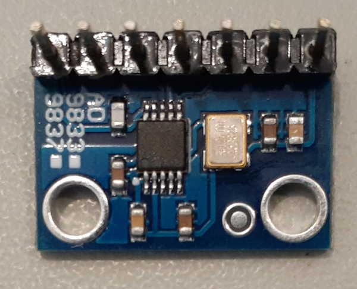
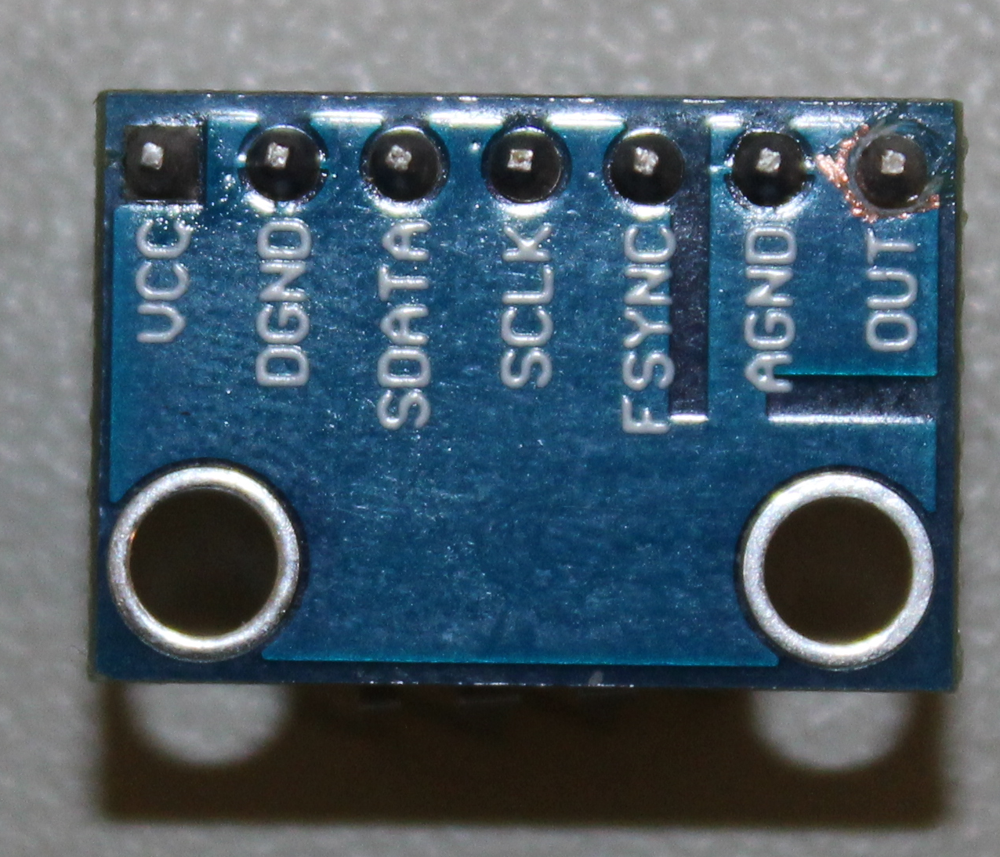
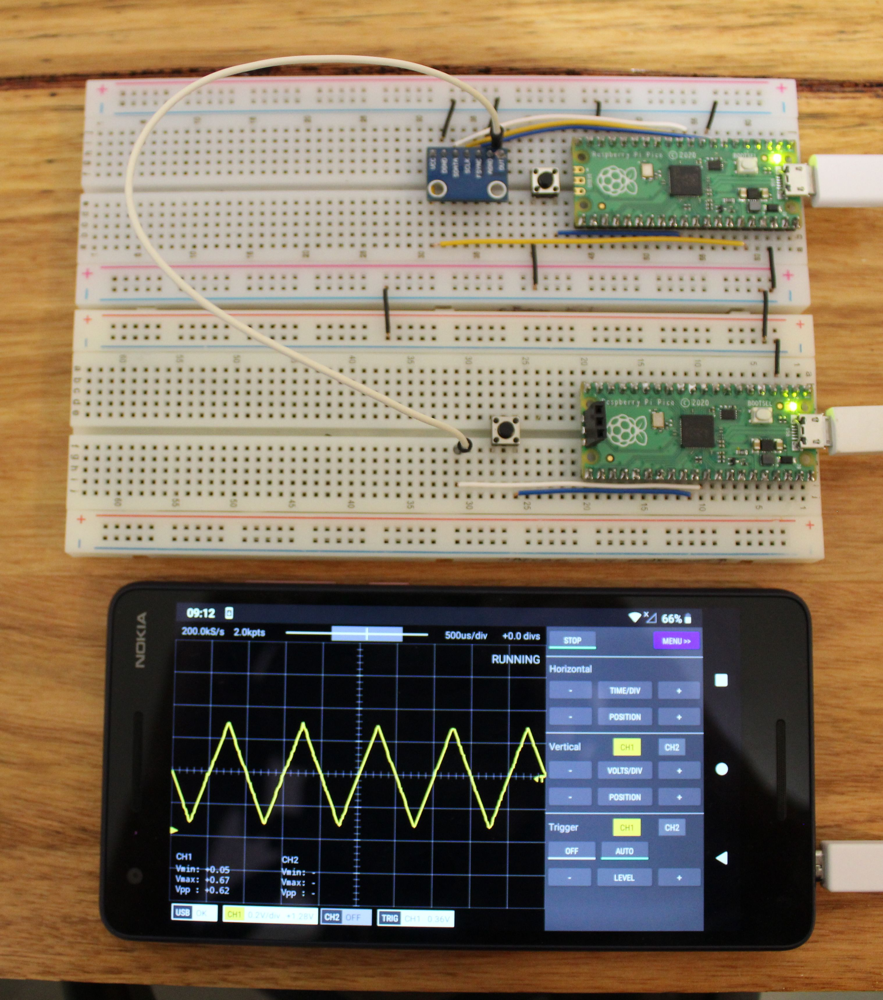

# fhdm-ad9833-pico
A C library for controlling the AD9833 programmable waveform generator using a Raspberry Pi Pico

 

## Quick Start

### Connect the Pico to your AD9833 board

- VCC of the AD9833 to 3.3V OUT of the Pico (pin 36)
- DGND and AGND to GND
- FSYNC to GPIO 5
- SCLK to GPIO 6
- SDATA to GPIO 7

Note: The GPIO pin assignments can be changed by calling ad9833.set_pins() before calling ad9833.start() 

### Configure your CMakeLists.txt file
```
...

# Add the repository as a subdirectory
# eg.
add_subdirectory(/some-path-on-my-computer/ad9833-pico/lib build)

# Include the library to target_link_libraries
# eg.
target_link_libraries(mytarget 
    fhdm-ad9833-pico
    pico_stdlib 
)
...
```

### Use the library

```
int main() {

    //  Declare a variable of type 'struct fhdm_ad9833' and initialise it:
    struct fhdm_ad9833 ad9833;
    fhdm_ad9833_pico_new(&ad9833);

    // Optionally set pins, frequency, phase, mclk, mode here otherwise the default
    // values are used. These are:
    // FSYNC PIN - GPIO 5
    // SCLK PIN - GPIO 6
    // SDATA PIN - GPIO 7
    // Frequency: 100Hz
    // Frequency register: 0
    // Phase angle: 0
    // Phase register: 0
    // Output mode: Sine wave

    // Start generating the output signal
    ad9833.start(&ad9833)

    // Change the frequency to 1Hz
    ad9833.set_frequency(&ad9833, 1.0);

    // Change the waveform to a triangle
    ad9833.set_mode(&ad9833, FHDM_AD9833_MODE_TRIANGLE);

    // More of your awesome code goes here
    ...

    return 0;
}
```

## API Usage

You first need to declare a variable of type 'struct fhdm_ad9833' and initialise it:

    struct fhdm_ad9833 ad9833;
    fhdm_ad9833_pico_new(&ad9833)
    
All subsequent function calls are made via the ad9833 variable (or whatever you have called it). The first parameter is always a pointer to the ad9833 variable. For example:

    ad9833.set_pins(&ad9833, 3, 4, 5);

The AD9833 is initialised and will start generating output when the 'start' function is called. Functions called before calling start will not affect the AD9833 until start is called.

    ad9833.start(&ad9833);

## API Reference

### __void set_mclk(struct fhdm_ad9833 *ad9833, uint32_t mclk)__
Set the master clock frequency. Default=25Mhz

### __void set_pins(struct fhdm_ad9833 *ad9833, uint fsync, uint sclk, uint sdata)__
Set the GPIO pins to be used for communicating with the AD9833 (use the GPIO number, not the pin number). This method must be called before start(). Default=FSYN:5, SCLK:6, SDATA:7.

### __void start(struct fhdm_ad9833 *ad9833)__
Initialise the AD9833 and start generating waveforms.

### __void set_frequency(struct fhdm_ad9833 *ad9833, float freq)__
Generate output at the given frequency (Hz). Stores the frequency in frequency register 0 and selects that register.

### __void set_phase(struct fhdm_ad9833 *ad9833, float phase)__
Generate output at the given phase angle (radians). Stores the phase in phase angle in register 0 and selects that register.

### __void set_mode(struct fhdm_ad9833 *ad9833, enum fhdm_ad9833_mode mode)__
Set the output type or put the AD9833 in sleep mode. Valid values for mode are FHDM_AD9833_MODE_SLEEP, FHDM_AD9833_MODE_SINE, FHDM_AD9833_MODE_TRIANGLE, FHDM_AD9833_MODE_SQUARE, FHDM_AD9833_MODE_SQUARE_DIV2.

### __void set_frequency_register_value(struct fhdm_ad9833 *ad9833, int reg_id, float freq)__
Store the frequency value in the given frequency register. The output will only change if that register is selected (eg. via select_freqency_register). Valid values for reg_id are 0 and 1.

### __void select_frequency_register(struct fhdm_ad9833 *ad9833, int reg_id)__
Select the frequency register used to generate the output. Valid values for reg_id are 0 and 1.

### __void set_phase_register_value(struct fhdm_ad9833 *ad9833, int reg_id, float phase)__
Store the phase value in the given phase register. The output will only change if that register is selected (eg. via select_phase_register). Valid values for reg_id are 0 and 1.

### __void select_phase_register(struct fhdm_ad9833 *ad9833, int reg_id)__
Select the phase register used to generate the output. Valid values for reg_id are 0 and 1.

## Gallery
### Square wave

From top to bottom
* AD9833 board controlled by a Raspberry Pi Pico using the ad9833-pico library. Generating a square wave at 100Hz.
* Raspberry Pi Pico running the [Scoppy oscilloscope](https://github.com/fhdm-dev/scoppy) firmware (GPIO 26 is connected to the output of the AD9833)
* The [Scoppy](https://github.com/fhdm-dev/scoppy) Android app on a Nokia 2.1

### Sine and Triangle waves

  


